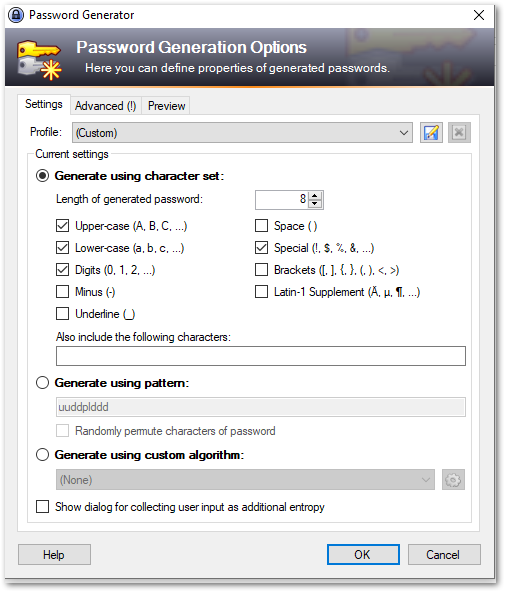
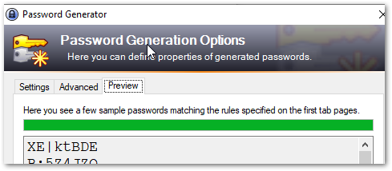
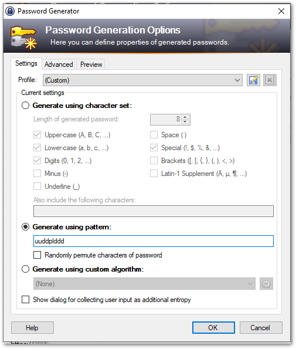
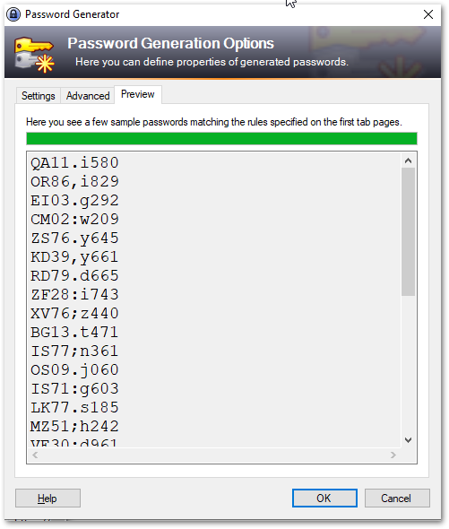

# Setting up a complex password pattern for KeePass's password generator

## Summary
KeePass includes a password generator.  However, even if you select various categories using "Generate using character set" (like uppercase letter, lower-case letter, digits), your generated password may not include characters from all these categorizes.  
There is another way to generate complex passwords, using "Generate using pattern", which will ensure your password meets a complexity policy.  

## Problem
"Generate using character set" won't necessarily generate passwords containing characters using all the items you click.  For example, using these settings:  
  
We can see the first password in the list does not have any digits in it, despite it being a selected character from our last screenshot:  
  

## Solution
We can use "Generate using pattern".  
  
As an example, you can use `uuddplddd` as your pattern, which according to [the KeePass documentation](https://keepass.info/help/base/pwgenerator.html) will give you a guarunteed upper, lower, digit, and special in your password.  Here are some examples of this pattern:  
  
You can save this password generation pattern by clicking Settings, then the Save button next to Profile to save this pattern.

*** 
_Mandatory_page_footer: This article and the rest of the [FreeKB](../README.md) is dedicated to the public domain via the [Creative Commons CC0](../LICENSE.md)._

