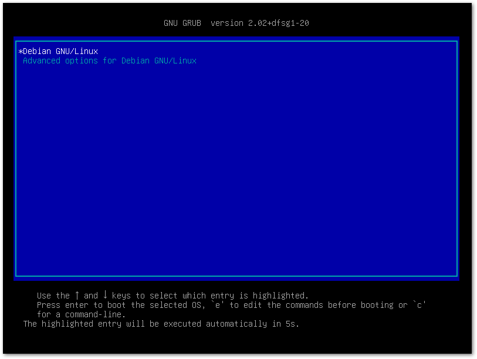
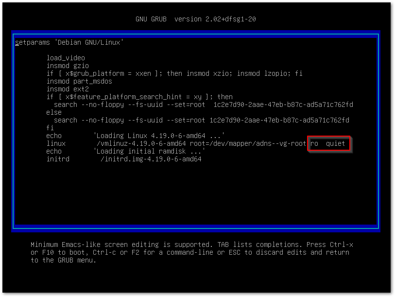
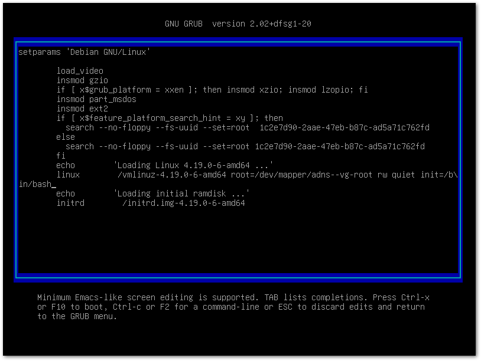
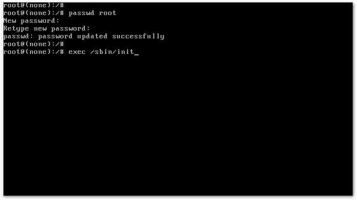

# Resetting the Linux root password without a boot disk

## Summary
It is possible to access a root shell without a boot disk, and without the root password, if you have console access to a Linux server.  Using this method you can reset any account password, or perform other tasks.

## Steps
1. Access the console, then reboot the server.  At the GRUB screen, press `e` to edit commands.  

1. Use the arrow keys to move the cursor to the end of the line that begins with `linux`.  

1. Replace `ro  quiet` with `rw quiet init=/bin/bash`.   Then press `Control+x` or `F10` to boot.  

1. When you see the `root@(none):/#` line appear, type `clear` for a clear screen.  
You are now in a root shell with the root filesystem mounted read/write.  
You can run `passwd root` to change the root account password.  
Once you are done, you can type `exec /sbin/init` (and press enter) to boot the server into it's usual run-level.  

***
_Mandatory_page_footer: This article and the rest of the FreeKB is dedicated to the public domain via the [Creative Commons CC0](../LICENSE.md)._

