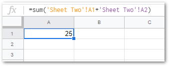

# Creating cross-sheet formula references in a spreadsheet

## Summary
You can reference values from other sheets in a spreadsheet workbook by including the sheet name in the reference.

## Steps
Suppose you have two sheets, one named "Sheet1" and one named "Sheet2".  

Suppose also that "Sheet2" contains some values you'd like to perform a formula on:  

In "Sheet1", you can refer to these using the following format: `SheetName`!`CellReference`

For example: "Sheet2!A1" would refer to the cell with a value of 10.

You can also construct formulas like this:

        =sum(Sheet2!A1+Sheet2!A2)

You can also use single quotes around the sheet name if there are spaces in it:

        =sum('Sheet Two'!A1+'Sheet Two'!A2)

***
_Mandatory_page_footer: This article and the rest of the FreeKB is dedicated to the public domain via the [Creative Commons CC0](../LICENSE.md)._

