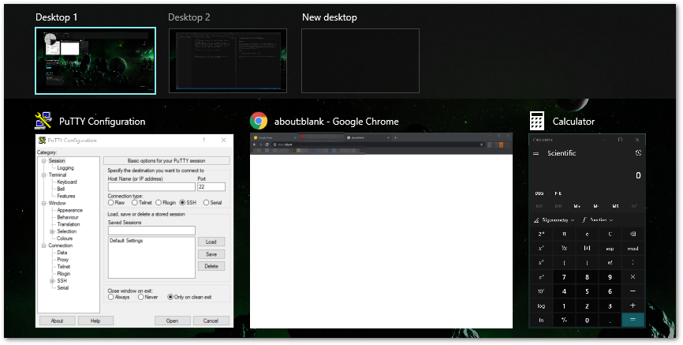
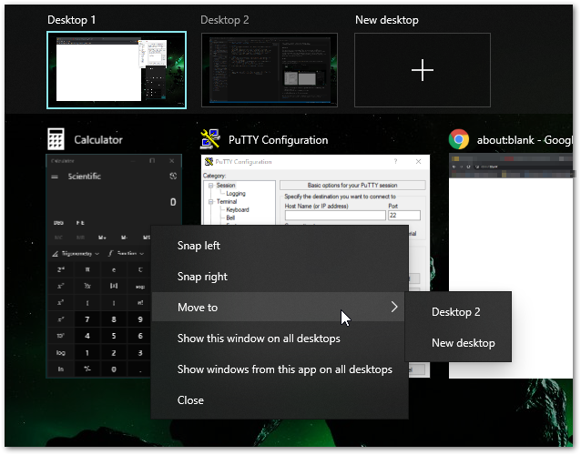
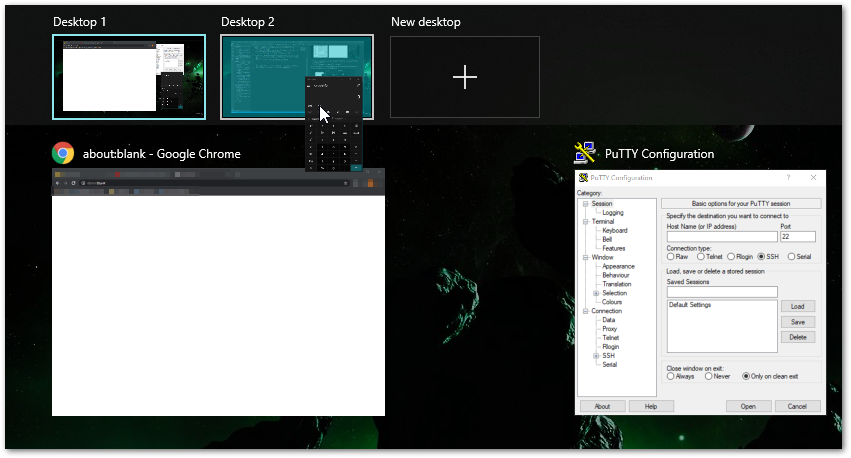

# Using Windows 10 Virtual Desktops

## Summary
The Virtual Desktops feature allows you to have different virtual screens that you can switch between.  
When you create and slide over to a new virtual desktop, all of your open applications disappear (but remain running in the background) and you see a blank workspace with a blank taskbar.  You can then open new applications that may be for a totally different task, keeping one task's applications on one virtual desktop, and another task's windows on another virtual desktop.

## Details
### Creating/Closing a Virtual Desktop
To work with Virtual Desktops, open Task View by pressing `Windows Key+Tab`. 

You will see a list of applications open on this Virtual Desktop:  

If we hover over "Desktop 1", we will see an "X" appear that will allow us to close that Desktop and all applications open on it.  
If we click "New desktop", a new virtual desktop will be created.

### Moving apps to a different virtual desktop:
Moving applications to a different virtual desktop:
- We can transfer applications from one virtual desktop to another.  One way is to right-click an application's thumbnail in Task View and choose from the available options:  

- Another way is to drag and drop the application thumbnail directly to the virtual desktopt thumbnail:  

### Switching between virtual desktops
To switch to a different virtual desktop, use Task View and click on the Virtual Desktop.  You can also use `Control+Windows Key+Left` or `Control+Windows Key+Right` to slide left and right thru your virtual desktops.

*** 
_Mandatory_page_footer: This article and the rest of the [FreeKB](../README.md) is dedicated to the public domain via the [Creative Commons CC0](../LICENSE.md)._

