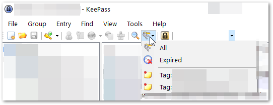

# KeePass - Show favorites upon idle

## Summary
A trigger can be setup in KeePass so that upon 10 minutes of inactivity (no interaction with KeePass and no Edit window open) KeePass will perform a search for all entries matching a certain tag (such as tagged with "Favorites") and then show only the entries that have that tag.  

This allows you to still use KeePass normally, but upon becoming idle for a time, for KeePass to always return to showing your "most useful / most favorite" entries, relieving you from searching/browsing for them repetitively.

## Steps
1. First you will need to tag one or more entries with a tag, such as "Favorites".  To do so, `Edit` an entry and under `Properties` set a Tag (such as "Favorites")
        
1. Next create a trigger to show your Favorites upon say 10 minutes of inactivity.  Click `Tools`, `Triggers`.
        
1. Click `Add`, set name as `Show favorites upon idle`.

1. Under `Events` tab, use event `Time - Periodic`.   Set `Interval` as `600`.   Set `Restart timer on KeePass activity`.

1. Under `Actions`, use Action `Show entries by tag`, and specify the tag you wish to search for, such as "Favorites".

1. Click `OK`, `Finish`, `OK`.

Effective immediately, after any 10 minutes of inactivity, KeePass will show simply your Favorite entries (which can be across multiple folders), giving you quick access to your most used entries.  You can still click any folder to go back to simply browsing your KeePass file, or use the Search to search as normal.

The next time you re-open/unlock KeePass, you will see all your entries, but after 10 minutes of inactivity, you will see your Favorites.  You can add an additional `Event` to the trigger if you want your favorites shown immediately after opening your database.

KeePass also keeps track of any defined tags in your file, and you can quickly search for already defined tags using the Find Entries button, located next to the Search box:

 

*** 
_Mandatory_page_footer: This article and the rest of the [FreeKB](../README.md) is dedicated to the public domain via the [Creative Commons CC0](../LICENSE.md)._

